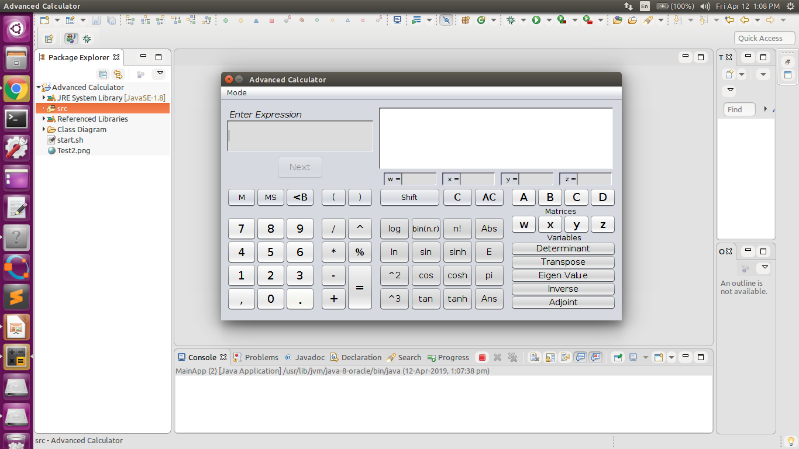

# Advanced-Calculator
Calculator capable of performing Algebraic , Trigonometric, Matrix, Definite Integral, Indefinite Integral and Differential Calculations along with Graph Plotter. This project was originally written using Eclipse, but I have made it runable through Terminal. This calculator is developed in Java along with python.

## Dependencies
The calculator is developed for ubuntu(linux) systems only. 
Install the following packages to your system default python:
- Sympy -``` pip install sympy ```
- Java version 1.8

## Command
  Download the repository and run ```java MainApp``` command through terminal inside bin folder.
  
## Screenshots

